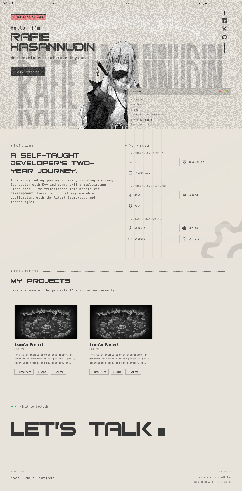
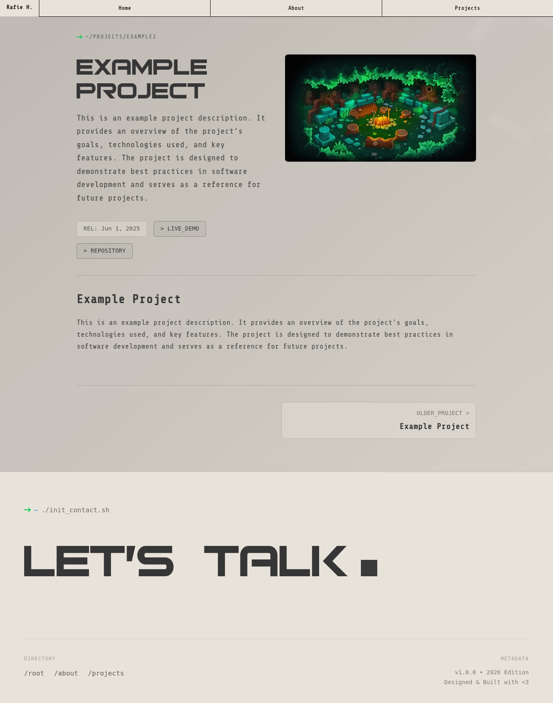
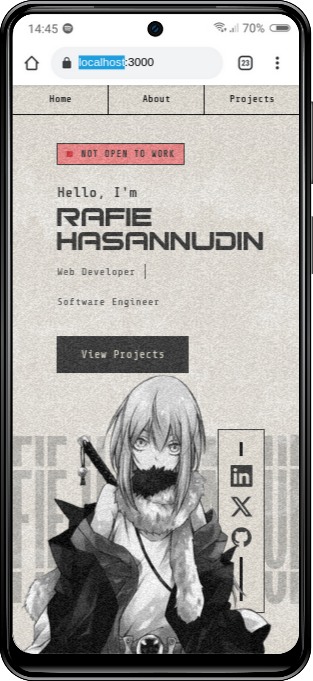
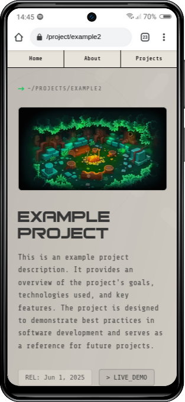

# Portfolio Project

A simple and to-the-point personal portfolio built with modern web technologies.

## Preview

### Desktop



### Mobile
 

## Tech Stack

*   **Framework:** [Next.js](https://nextjs.org/) (App Router)
*   **Library:** [React](https://react.dev/)
*   **Styling:** [Tailwind CSS](https://tailwindcss.com/) & [clsx](https://github.com/lukeed/clsx) / [tailwind-merge](https://github.com/dcastil/tailwind-merge)
*   **UI Components:** [Radix UI](https://www.radix-ui.com/) & [shadcn/ui](https://ui.shadcn.com/)
*   **Content:** [MDX](https://mdxjs.com/) & [Remark](https://github.com/remarkjs/remark)
*   **Animations:** [Motion (Framer Motion)](https://motion.dev/) & [GSAP](https://gsap.com/)
*   **Icons:** [Lucide React](https://lucide.dev/) & [React Icons](https://react-icons.github.io/react-icons/)
*   **Caching/Storage:** [Cloudflare Workers](https://workers.cloudflare.com/) & [R2](https://www.cloudflare.com/developer-platform/r2/)

## Features

*   **MDX Support:** Write content (like the about page and projects) quickly using MDX.
*   **Interactive Animations:** Smooth page transitions and text splitting animations powered by Framer Motion and GSAP.
*   **Dark/Light Mode:** Seamless theme switching with `next-themes`.
*   **Responsive Layout:** Fully responsive UI relying on Tailwind CSS.
*   **Dynamic Open Graph Images:** Automatically generated OG images for every page, cached on Cloudflare R2 for better performance.

## Getting Started

First, install the dependencies (assuming you use `npm`, `yarn`, `pnpm`, or `bun`):

```bash
npm install
# or
yarn install
# or
pnpm install
# or
bun install
```

Then, run the development server:

```bash
npm run dev
# or
yarn dev
# or
pnpm dev
# or
bun dev
```

Open [http://localhost:3000](http://localhost:3000) with your browser to see the result.

## Project Structure

*   `src/app/` - Next.js App Router (pages, layout, routing)
*   `src/components/` - Reusable UI components (buttons, nav, layouts, sections)
*   `content/` - MDX content files for projects and general pages
*   `public/` - Static assets like images and site manifests
*   `cloudflare-r2-worker/` - Cloudflare Worker for caching Open Graph images in R2

## Cloudflare R2 Worker Setup

This project uses a Cloudflare Worker to cache generated Open Graph images. Follow these steps to setup and deploy:

1.  **Navigate to the worker directory:**
    ```bash
    cd cloudflare-r2-worker
    ```

2.  **Login to Cloudflare:**
    ```bash
    npx wrangler login
    ```

3.  **Create an R2 bucket:**
    ```bash
    npx wrangler r2 bucket create portfolio-og
    ```
    > [!IMPORTANT]
    > `portfolio-og` is the recommended bucket name. You can use a different bucket name, but you must update `wrangler.jsonc` (line 19), `src/index.ts` (lines 21 & 26), and regenerate types using `npx wrangler types`.

4.  **Verify the bucket:**
    ```bash
    npx wrangler r2 bucket list
    ```

5.  **Deploy:**
    ```bash
    # Optional: Local testing
    npx wrangler dev

    # Deploy to production
    npx wrangler deploy
    ```

6.  **Configure Environment Variable:**
    Get the worker URL from the deployment output (e.g., `https://cloudflare-r2-worker.yourcloudflare.workers.dev`) or use `http://localhost:8787` for local development (output from `npx wrangler dev`), and set it as an environment variable in your project:
    ```bash
    # Production
    CLOUDFLARE_R2_WORKER_URL=https://your-worker-url.workers.dev
    # or
    # Development
    CLOUDFLARE_R2_WORKER_URL=http://localhost:8787
    ```

## Routing & Build Preview

Here is an overview of the app's routing structure generated during a production build:

```bash
Route (app)
┌ ○ /
├ ○ /_not-found
├ ƒ /og
├ ● /project/[slug]
│ ├ /project/example2
│ └ /project/example
├ ○ /robots.txt
└ ○ /sitemap.xml

○  (Static)   prerendered as static content
●  (SSG)      prerendered as static HTML (uses generateStaticParams)
ƒ  (Dynamic)  server-rendered on demand
```
